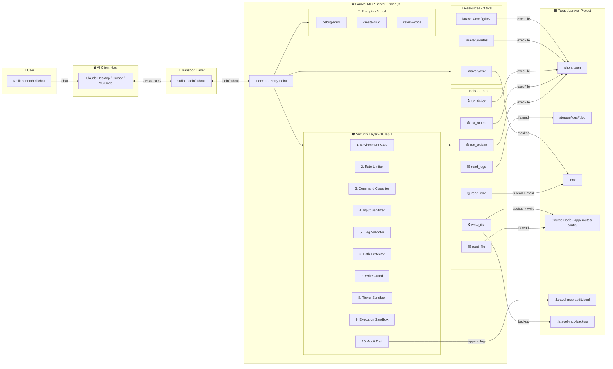
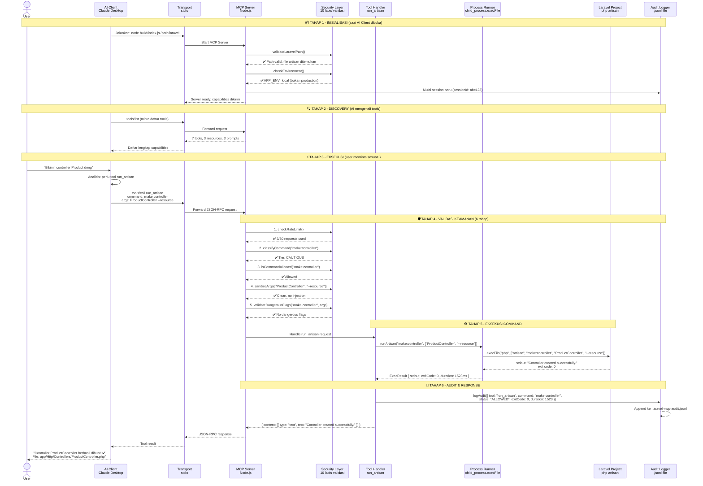
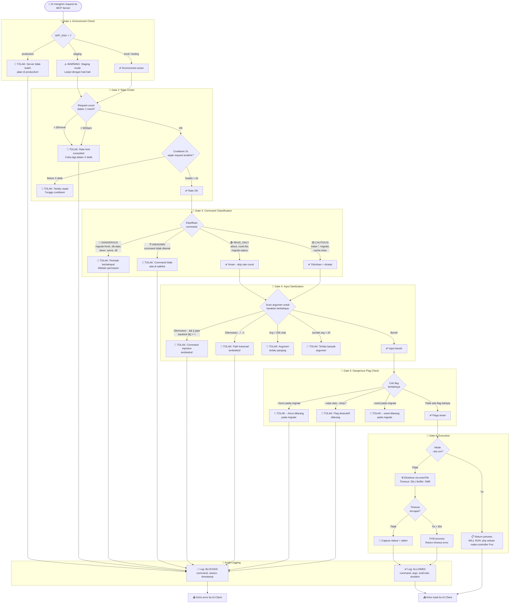

# Laravel MCP Server — Full Implementation Plan

Membangun MCP Server berbasis TypeScript/Node.js yang menjadi "jembatan" antara AI Client (Claude Desktop, Cursor, dll.) dan proyek Laravel lokal. Server ini memungkinkan AI menjalankan perintah artisan, membaca log, membaca file, dan lainnya — dengan **pengamanan berlapis dan ketat** karena AI yang mengontrol terminal secara otomatis adalah risiko tinggi.

---

## User Review Required

> [!IMPORTANT]
> **Path Laravel belum ditentukan.** Server ini membutuhkan path proyek Laravel sebagai argument saat dijalankan. Kamu bisa menentukan path nanti saat konfigurasi di Claude Desktop / Cursor.

> [!WARNING]
> **Tools yang menulis file (`write_file`)** bisa mengubah source code Laravelmu. Fitur ini dibuat sebagai opsional dan memerlukan flag `--allow-write` saat menjalankan server. Tanpa flag tersebut, tool ini **tidak akan terdaftar sama sekali**.

> [!CAUTION]
> **`run_tinker`** bisa mengeksekusi kode PHP arbitrary. Tool ini memerlukan flag `--allow-tinker` DAN secara default berjalan dalam **sandbox mode** yang memblokir 15+ fungsi PHP berbahaya. Gunakan dengan sangat hati-hati.

> [!CAUTION]
> **Semua perintah yang dijalankan AI akan dicatat dalam Audit Log** (`~/.laravel-mcp/audit.log`). Ini penting untuk melacak apa saja yang dilakukan AI di mesinmu. Kamu bisa me-review log ini kapan saja.

---

## Open Questions

> [!IMPORTANT]
> 1. **Apakah kamu ingin mendukung multiple Laravel projects sekaligus?** Saat ini desain hanya support 1 project per instance server. Untuk multiple projects, kamu bisa menjalankan beberapa instance server.
> 2. **Apakah ada perintah artisan custom di proyekmu yang perlu di-whitelist?** Saat ini safelist mencakup perintah bawaan Laravel standar saja.

---

## Proposed Changes

Semua file dibuat baru di dalam `E:\desain-ui\laravel-mcp-server\`.

---

### Konfigurasi Proyek

#### [NEW] [package.json](file:///e:/desain-ui/laravel-mcp-server/package.json)

```json
{
  "name": "laravel-mcp-server",
  "version": "1.0.0",
  "description": "MCP Server for Laravel development — run artisan, read logs, inspect routes & more",
  "type": "module",
  "main": "build/index.js",
  "bin": {
    "laravel-mcp": "build/index.js"
  },
  "scripts": {
    "dev": "tsx watch src/index.ts",
    "build": "tsc",
    "start": "node build/index.js",
    "inspect": "npx @modelcontextprotocol/inspector node build/index.js"
  },
  "dependencies": {
    "@modelcontextprotocol/sdk": "^1.30.0",
    "zod": "^3.23.0"
  },
  "devDependencies": {
    "typescript": "^5.5.0",
    "@types/node": "^22.0.0",
    "tsx": "^4.19.0"
  }
}
```

#### [NEW] [tsconfig.json](file:///e:/desain-ui/laravel-mcp-server/tsconfig.json)

Konfigurasi TypeScript strict mode dengan target ESM:

```json
{
  "compilerOptions": {
    "target": "ES2022",
    "module": "Node16",
    "moduleResolution": "Node16",
    "outDir": "./build",
    "rootDir": "./src",
    "strict": true,
    "esModuleInterop": true,
    "skipLibCheck": true,
    "forceConsistentCasingInFileNames": true,
    "resolveJsonModule": true,
    "declaration": true,
    "declarationMap": true,
    "sourceMap": true
  },
  "include": ["src/**/*"],
  "exclude": ["node_modules", "build"]
}
```

---

### Entry Point

#### [NEW] [src/index.ts](file:///e:/desain-ui/laravel-mcp-server/src/index.ts)

Entry point utama yang:
1. Parse CLI arguments (`--allow-write`, `--allow-tinker`, `--dry-run`, path Laravel)
2. Validasi bahwa path adalah proyek Laravel (cek file `artisan`)
3. **Cek environment** — jika `.env` berisi `APP_ENV=production`, server **menolak untuk start** (safety first!)
4. Inisialisasi `McpServer` dengan nama `laravel-dev-server`
5. Inisialisasi **Audit Logger** — semua operasi akan dicatat
6. Registrasi semua tools, resources, dan prompts (sesuai flag yang aktif)
7. Connect via `StdioServerTransport`
8. Handle graceful shutdown (`SIGINT`, `SIGTERM`) — kill semua child process yang running

---

### Tools (4 core + 2 optional)

Semua tools berada di folder `src/tools/`.

> [!IMPORTANT]
> **Sistem Klasifikasi 3-Tier Risk** — Setiap perintah artisan dikategorikan berdasarkan tingkat risikonya. Ini menentukan bagaimana server memperlakukan setiap perintah.

| Tier | Level | Warna | Perlakuan |
|---|---|---|---|
| 🟢 **READ-ONLY** | Aman | Hijau | Langsung dieksekusi tanpa batasan |
| 🟡 **CAUTIOUS** | Hati-hati | Kuning | Dieksekusi + dicatat di audit log + rate-limited |
| 🔴 **DANGEROUS** | Berbahaya | Merah | **DIBLOKIR TOTAL** — tidak bisa dijalankan dalam kondisi apapun |

#### [NEW] [src/tools/run-artisan.ts](file:///e:/desain-ui/laravel-mcp-server/src/tools/run-artisan.ts)

**Tool: `run_artisan`** — Menjalankan perintah `php artisan` yang aman.

| Parameter | Tipe | Deskripsi |
|---|---|---|
| `command` | `string` | Perintah artisan (e.g. `make:controller`) |
| `args` | `string[]` (optional) | Argumen tambahan (e.g. `["ProductController", "--resource"]`) |

**Logika utama (6 tahap validasi sebelum eksekusi):**

1. **Cek Rate Limit** — Max 30 perintah per menit. Jika melebihi, tolak dengan error `RATE_LIMIT_EXCEEDED`
2. **Cek Blocklist** — Jika command ada di tier 🔴 DANGEROUS → tolak langsung
3. **Cek Safelist** — Jika command tidak ada di tier 🟢 atau 🟡 → tolak dengan error `COMMAND_NOT_ALLOWED`
4. **Sanitasi Argumen** — Tolak karakter berbahaya (`;`, `&&`, `||`, `` ` ``, `$()`, dan lainnya)
5. **Cek Flag Berbahaya** — Tolak argumen `--force` pada perintah `migrate` (mencegah eksekusi di production)
6. **Eksekusi** — Via `child_process.execFile` (BUKAN `exec`) untuk mencegah shell injection
7. **Audit Log** — Catat command, args, timestamp, exit code, dan output ke audit log

Jika `--dry-run` aktif, langkah 6 dilewati dan server hanya menampilkan preview command yang *akan* dijalankan.

**🟢 Tier READ-ONLY (Langsung eksekusi):**
```
about               → Display app info
env                 → Display environment  
route:list          → Daftar routes
migrate:status      → Check migration status
schedule:list       → List scheduled commands
config:show         → Show config value
```

**🟡 Tier CAUTIOUS (Eksekusi + audit log + rate-limited):**
```
make:*              → Semua generator (controller, model, migration, dll)
route:cache         → Cache routes
route:clear         → Clear route cache
config:cache        → Cache config
config:clear        → Clear config cache
cache:clear         → Clear application cache
view:clear          → Clear compiled views
optimize            → Optimize framework
optimize:clear      → Clear optimizations
migrate             → Run migrations (TANPA --force)
db:seed             → Seed database (TANPA --force)
key:generate        → Generate app key
storage:link        → Create storage symlink
```

**🔴 Tier DANGEROUS (DIBLOKIR TOTAL — hardcoded, tidak bisa di-override):**
```
migrate:fresh       → Hapus SEMUA tabel lalu migrate ulang
migrate:reset       → Rollback SEMUA migration
migrate:rollback    → Rollback migration terakhir
migrate:refresh     → Reset + migrate ulang
db:wipe             → Hapus SEMUA tabel, views, dan types
down                → Matikan aplikasi (maintenance mode)
up                  → Nyalakan aplikasi (pasangan 'down')
tinker              → Ada tool terpisah yang lebih terkontrol
serve               → Blocking command, bisa hang server
queue:restart       → Restart semua queue workers
event:generate      → Generate events (bisa overwrite)
vendor:publish      → Publish assets (bisa overwrite)
schedule:run        → Jalankan semua scheduled tasks sekaligus
notifications:table → Modifikasi database
session:table       → Modifikasi database
queue:table         → Modifikasi database
cache:table         → Modifikasi database
package:discover    → Auto-discovery packages (security risk)
stub:publish        → Publish stubs (overwrite risk)
```

**🛡️ Flag Berbahaya yang Diblokir pada Semua Perintah:**
```
--force             → Diblokir pada: migrate, db:seed, key:generate
--seed              → Diblokir pada: migrate (bisa trigger seeder tak terduga)
--drop-*            → Diblokir pada semua perintah
--wipe              → Diblokir pada semua perintah
--pretend           → Diizinkan (berguna untuk preview)
```

#### [NEW] [src/tools/read-logs.ts](file:///e:/desain-ui/laravel-mcp-server/src/tools/read-logs.ts)

**Tool: `read_logs`** — Membaca baris terakhir dari Laravel log.

| Parameter | Tipe | Deskripsi |
|---|---|---|
| `lines` | `number` (default: 100) | Jumlah baris terakhir yang dibaca (max 500) |
| `filter` | `string` (optional) | Filter keyword (e.g. `"ERROR"`, `"CRITICAL"`) |

**Logika utama:**
- Baca file `storage/logs/laravel.log`
- Jika file tidak ada, cek pola `laravel-YYYY-MM-DD.log` (daily rotation)
- Gunakan teknik **reverse-read** (baca dari akhir file) untuk efisiensi pada file besar
- Terapkan filter jika diminta
- Batasi output ke max 500 baris (hardcoded limit)

#### [NEW] [src/tools/list-routes.ts](file:///e:/desain-ui/laravel-mcp-server/src/tools/list-routes.ts)

**Tool: `list_routes`** — Menampilkan daftar route Laravel dalam format JSON.

| Parameter | Tipe | Deskripsi |
|---|---|---|
| `method` | `string` (optional) | Filter by HTTP method (`GET`, `POST`, dll) |
| `path` | `string` (optional) | Filter by path pattern |

**Logika:**
- Jalankan `php artisan route:list --json`
- Parse output JSON
- Terapkan filter method/path jika diminta
- Return tabel yang formatted

#### [NEW] [src/tools/read-env.ts](file:///e:/desain-ui/laravel-mcp-server/src/tools/read-env.ts)

**Tool: `read_env`** — Membaca file `.env` dengan masking nilai sensitif.

| Parameter | Tipe | Deskripsi |
|---|---|---|
| `show_values` | `boolean` (default: false) | Tampilkan nilai asli tanpa masking |

**Logika:**
- Baca file `.env` di root proyek Laravel
- Secara default, **mask** nilai dari key yang mengandung: `PASSWORD`, `SECRET`, `KEY`, `TOKEN`, `HASH`, `PRIVATE`, `CREDENTIAL`
- Nilai yang di-mask ditampilkan sebagai `***MASKED***`
- Jika `show_values = true`, tampilkan semua nilai asli

#### [NEW] [src/tools/read-file.ts](file:///e:/desain-ui/laravel-mcp-server/src/tools/read-file.ts)

**Tool: `read_file`** — Membaca file source code dari proyek Laravel.

| Parameter | Tipe | Deskripsi |
|---|---|---|
| `path` | `string` | Path relatif dari root proyek (e.g. `app/Models/User.php`) |

**Logika & Keamanan:**
- **Path traversal protection**: Resolve path absolut, lalu pastikan masih di dalam root proyek Laravel (prevent `../../etc/passwd`)
- Tolak file `.env` (ada tool khusus yang masked)
- Batasi ukuran file: max 1MB
- Return isi file sebagai text

#### [NEW] [src/tools/write-file.ts](file:///e:/desain-ui/laravel-mcp-server/src/tools/write-file.ts)

**Tool: `write_file`** *(hanya aktif jika `--allow-write`)* — Menulis/mengedit file di proyek Laravel.

| Parameter | Tipe | Deskripsi |
|---|---|---|
| `path` | `string` | Path relatif dari root proyek |
| `content` | `string` | Isi file yang ditulis |

**Logika & Keamanan (7 lapis validasi):**
1. **Path traversal protection** — resolve path absolut, pastikan tetap di dalam root proyek
2. **Directory whitelist** — **Hanya izinkan menulis ke**: `app/`, `routes/`, `database/migrations/`, `database/seeders/`, `database/factories/`, `resources/views/`, `config/`, `tests/`
3. **Directory blacklist** — **Tolak menulis ke**: `.env`, `vendor/`, `node_modules/`, `storage/`, `public/`, `bootstrap/`, `artisan`, `composer.json`, `composer.lock`, `.git/`
4. **File extension whitelist** — Hanya izinkan: `.php`, `.blade.php`, `.json`, `.yaml`, `.yml`, `.xml`, `.stub`, `.md`, `.txt`. Tolak: `.sh`, `.bat`, `.exe`, `.phar`, `.js`, `.env*`
5. **Max file size** — Tolak content yang lebih dari 500KB (mencegah spam/abuse)
6. **Auto-backup** — Sebelum overwrite, buat backup otomatis ke `.laravel-mcp-backup/` di root proyek dengan format `{filename}.{timestamp}.bak`
7. **Audit log** — Catat setiap file yang ditulis, termasuk path, ukuran, dan hash SHA-256

#### [NEW] [src/tools/run-tinker.ts](file:///e:/desain-ui/laravel-mcp-server/src/tools/run-tinker.ts)

**Tool: `run_tinker`** *(hanya aktif jika `--allow-tinker`)* — Menjalankan ekspresi PHP via artisan tinker.

| Parameter | Tipe | Deskripsi |
|---|---|---|
| `code` | `string` | Kode PHP yang akan dieksekusi |

**Logika & Keamanan (5 lapis validasi):**
1. **Timeout ultra-ketat**: 10 detik (non-configurable)
2. **Max code length**: 2000 karakter
3. **Blokir fungsi PHP berbahaya** (regex match pada kode input):
   ```
   exec, system, passthru, shell_exec, popen, proc_open     → Shell execution
   unlink, rmdir, mkdir, rename, copy, chmod, chown          → Filesystem modification
   file_put_contents, fwrite, fopen (mode 'w'/'a')           → File writing
   curl_exec, file_get_contents (http/ftp)                   → Network access
   eval, assert, preg_replace (with /e flag)                 → Code execution
   ini_set, putenv, dl                                       → Runtime config change
   ```
4. **Blokir keyword Eloquent berbahaya**:
   ```
   ::truncate(), ::delete(), ->forceDelete(),
   DB::statement(), DB::unprepared(),
   Schema::drop(), Schema::dropIfExists()
   ```
5. **Audit log** — Catat kode PHP yang dijalankan, output, dan exit code

---

### Resources

Semua resources berada di folder `src/resources/`.

#### [NEW] [src/resources/laravel-info.ts](file:///e:/desain-ui/laravel-mcp-server/src/resources/laravel-info.ts)

Mendaftarkan 3 resources:

1. **`laravel://env`** (Static Resource)
   - Mengembalikan isi `.env` yang sudah di-mask
   - Mime type: `text/plain`

2. **`laravel://routes`** (Static Resource)
   - Mengembalikan output `php artisan route:list --json`
   - Mime type: `application/json`

3. **`laravel://config/{key}`** (Dynamic Resource Template)
   - Mengembalikan nilai konfigurasi Laravel via `php artisan config:show {key}`
   - Contoh: `laravel://config/app.name` → `"My App"`
   - Mime type: `application/json`

---

### Prompts

#### [NEW] [src/prompts/laravel-prompts.ts](file:///e:/desain-ui/laravel-mcp-server/src/prompts/laravel-prompts.ts)

Mendaftarkan 3 prompt templates:

1. **`debug-error`**
   - Deskripsi: "Baca log error terakhir dan analisis penyebabnya"
   - Parameter: `lines` (number, default 50)
   - Logika: Otomatis membaca log terakhir, lalu generate prompt yang meminta AI menganalisis error

2. **`create-crud`**
   - Deskripsi: "Generate CRUD lengkap untuk sebuah model"
   - Parameter: `model_name` (string), `fields` (string — comma-separated)
   - Logika: Generate prompt yang meminta AI membuat Model, Migration, Controller, Routes untuk entity tersebut

3. **`review-code`**
   - Deskripsi: "Review sebuah file Laravel dan berikan saran perbaikan"
   - Parameter: `file_path` (string)
   - Logika: Baca file tersebut lalu generate prompt untuk code review fokus pada Laravel best practices

---

### Security Layer (Diperkuat)

> [!CAUTION]
> Security layer ini dirancang dengan prinsip **Defense in Depth** — setiap lapisan keamanan berdiri sendiri. Jika satu lapisan gagal, lapisan lain tetap melindungi sistem.

#### [NEW] [src/utils/security.ts](file:///e:/desain-ui/laravel-mcp-server/src/utils/security.ts)

Modul keamanan utama — **jantung dari seluruh sistem proteksi:**

```typescript
// ==========================================
// VALIDASI & KLASIFIKASI
// ==========================================
validateLaravelPath(path: string): void
  // Cek file `artisan` ada di path
  // Cek folder `app/`, `config/`, `routes/` ada
  // Jika tidak valid → throw error, server tidak akan start

checkEnvironment(laravelPath: string): void
  // Baca .env, cek APP_ENV
  // Jika APP_ENV=production → throw error, TOLAK start server
  // Jika APP_ENV=staging → tampilkan warning di stderr

classifyCommand(command: string): 'READ_ONLY' | 'CAUTIOUS' | 'DANGEROUS'
  // Kategorikan command ke 3 tier
  // Unknown command → otomatis 'DANGEROUS'

isCommandAllowed(command: string): { allowed: boolean; tier: string; reason: string }
  // Return detail lengkap: apakah diizinkan, tier-nya apa, alasan penolakan

// ==========================================
// SANITASI INPUT
// ==========================================
sanitizeArgs(args: string[]): string[]
  // Tolak karakter berbahaya: ; && || | ` $( ${ > < \n \r \0
  // Tolak path traversal di argumen: ../
  // Trim whitespace
  // Max panjang per argumen: 255 karakter
  // Max jumlah argumen: 20

validateDangerousFlags(command: string, args: string[]): void
  // Tolak --force pada migrate, db:seed, key:generate
  // Tolak --seed pada migrate
  // Tolak --drop-* dan --wipe pada semua perintah
  // Tolak --no-interaction pada perintah destructive

sanitizeTinkerCode(code: string): { safe: boolean; blocked: string[] }
  // Scan kode PHP untuk fungsi/keyword berbahaya
  // Return daftar fungsi yang diblokir jika ditemukan

// ==========================================
// FILE SYSTEM PROTECTION
// ==========================================
isPathSafe(relativePath: string, rootPath: string): string
  // Resolve ke absolute path
  // Pastikan masih di dalam rootPath
  // Tolak symlink yang mengarah keluar rootPath
  // Return absolute path jika aman

isWriteAllowed(relativePath: string): { allowed: boolean; reason: string }
  // Cek directory whitelist & blacklist
  // Cek file extension whitelist
  // Return detail alasan jika ditolak

maskEnvValues(content: string): string
  // Mask nilai dari key sensitif:
  // PASSWORD, SECRET, KEY, TOKEN, HASH, PRIVATE, CREDENTIAL,
  // API_KEY, AUTH, MAIL_PASSWORD, AWS_*, REDIS_PASSWORD,
  // DB_PASSWORD, PUSHER_*, MIX_PUSHER_*

computeFileHash(content: string): string
  // SHA-256 hash untuk audit trail
```

**Detail karakter yang diblokir dalam sanitasi:**
```
;        → Command chaining
&&       → Conditional execution
||       → Conditional execution
|        → Pipe (bisa kirim output ke command lain)
`        → Backtick execution
$(       → Command substitution
${       → Variable expansion
>        → Output redirection
<        → Input redirection
\n \r    → Newline injection
\0       → Null byte injection
../ ..\  → Path traversal
~        → Home directory expansion
```

#### [NEW] [src/utils/audit.ts](file:///e:/desain-ui/laravel-mcp-server/src/utils/audit.ts)

**Audit Logger** — Mencatat SETIAP operasi yang dilakukan AI:

```typescript
interface AuditEntry {
  timestamp: string;          // ISO 8601
  sessionId: string;          // Unique per server session
  tool: string;               // Nama tool yang dipanggil
  tier: string;               // READ_ONLY | CAUTIOUS | DANGEROUS
  command?: string;           // Perintah artisan (jika ada)
  args?: string[];            // Argumen
  filePath?: string;          // File yang dibaca/ditulis (jika ada)
  exitCode?: number;          // Exit code (jika command)
  outputSize?: number;        // Ukuran output dalam bytes
  fileHash?: string;          // SHA-256 hash file yang ditulis
  status: 'ALLOWED' | 'BLOCKED' | 'ERROR';  // Hasil
  reason?: string;            // Alasan jika blocked
  duration?: number;          // Durasi eksekusi dalam ms
}

// Fungsi yang diekspor:
logAudit(entry: AuditEntry): void
  // Tulis ke file: {laravelPath}/.laravel-mcp-audit.jsonl
  // Format: JSON Lines (satu entry per baris)
  // File ini di-append, tidak pernah di-overwrite
  // Auto-rotate: jika file > 10MB, rename ke .audit.{date}.jsonl

getAuditStats(): { total: number; blocked: number; allowed: number }
  // Statistik session saat ini (in-memory counter)
```

**Contoh entry audit log:**
```json
{"timestamp":"2026-07-31T21:15:00.000Z","sessionId":"abc123","tool":"run_artisan","tier":"CAUTIOUS","command":"make:controller","args":["ProductController","--resource"],"exitCode":0,"outputSize":45,"status":"ALLOWED","duration":1523}
{"timestamp":"2026-07-31T21:15:05.000Z","sessionId":"abc123","tool":"run_artisan","tier":"DANGEROUS","command":"migrate:fresh","args":[],"status":"BLOCKED","reason":"Command migrate:fresh is in DANGEROUS tier and permanently blocked"}
```

#### [NEW] [src/utils/rate-limiter.ts](file:///e:/desain-ui/laravel-mcp-server/src/utils/rate-limiter.ts)

**Rate Limiter** — Mencegah AI mengeksekusi terlalu banyak perintah terlalu cepat:

```typescript
interface RateLimiterConfig {
  maxRequestsPerMinute: number;    // Default: 30
  maxRequestsPerHour: number;      // Default: 500
  cooldownMs: number;              // Default: 2000ms (jeda minimum antar perintah)
}

// Fungsi yang diekspor:
checkRateLimit(): { allowed: boolean; retryAfterMs?: number; reason?: string }
recordRequest(): void
resetLimiter(): void
```

**Logika:**
- Sliding window 1 menit: max 30 perintah
- Sliding window 1 jam: max 500 perintah
- Cooldown: minimum 2 detik antar perintah CAUTIOUS
- Perintah READ_ONLY tidak dihitung dalam rate limit
- Jika limit tercapai, return `retryAfterMs` agar AI tahu kapan boleh coba lagi

#### [NEW] [src/utils/process.ts](file:///e:/desain-ui/laravel-mcp-server/src/utils/process.ts)

Wrapper untuk `child_process.execFile`:

```typescript
interface ExecResult {
  stdout: string;
  stderr: string;
  exitCode: number;
  duration: number;          // Durasi eksekusi dalam ms
  killed: boolean;           // True jika di-kill karena timeout
}

// Fungsi yang diekspor:
runArtisan(command: string, args: string[], options: ExecOptions): Promise<ExecResult>
findPhpBinary(): Promise<string>  // Cari `php` di PATH, throw jika tidak ada
killAllChildren(): void           // Kill semua child process (untuk graceful shutdown)
```

**Konfigurasi:**
- Default timeout: 30.000ms (CAUTIOUS), 10.000ms (tinker)
- Max buffer: 5MB (dikurangi dari 10MB untuk safety)
- Max output yang dikirim ke AI: 50KB (truncate sisanya)
- CWD: root proyek Laravel
- Environment: **stripped** — hanya forward variabel yang aman, hapus variabel sensitif
- **Tidak ada shell**: Selalu `execFile`, TIDAK PERNAH `exec`

#### [NEW] [src/utils/file.ts](file:///e:/desain-ui/laravel-mcp-server/src/utils/file.ts)

Helper untuk operasi file:

```typescript
// Fungsi yang diekspor:
readLastLines(filePath: string, lineCount: number): Promise<string>  // Tail file
findLogFile(laravelPath: string): Promise<string>  // Cari log terbaru
readFileContent(filePath: string, maxSizeBytes: number): Promise<string>
writeFileContent(filePath: string, content: string, allowedDirs: string[]): Promise<void>
createBackup(filePath: string, backupDir: string): Promise<string>  // Return path backup
```

#### [NEW] [src/utils/config.ts](file:///e:/desain-ui/laravel-mcp-server/src/utils/config.ts)

Parsing konfigurasi dari CLI arguments:

```typescript
interface ServerConfig {
  laravelPath: string;       // Path absolut ke proyek Laravel
  phpBinary: string;         // Default: "php"
  commandTimeout: number;    // Default: 30000ms
  maxLogLines: number;       // Default: 200
  allowWrite: boolean;       // Default: false (aktif via --allow-write)
  allowTinker: boolean;      // Default: false (aktif via --allow-tinker)
  dryRun: boolean;           // Default: false (aktif via --dry-run)
  rateLimit: number;         // Default: 30 per menit
}

// Fungsi yang diekspor:
parseConfig(argv: string[]): ServerConfig
```

**Contoh penggunaan:**
```bash
# Minimal (mode paling aman — read-only + artisan dasar)
node build/index.js /path/to/laravel

# Dengan dry-run (preview mode — tidak ada eksekusi)
node build/index.js /path/to/laravel --dry-run

# Dengan write access
node build/index.js /path/to/laravel --allow-write

# Full access (gunakan dengan hati-hati!)
node build/index.js /path/to/laravel --allow-write --allow-tinker --php /usr/bin/php8.2 --timeout 60000
```

---

### Testing

#### [NEW] [tests/security.test.ts](file:///e:/desain-ui/laravel-mcp-server/tests/security.test.ts)

Unit test untuk modul keamanan (menggunakan Node.js built-in test runner `node:test`):

**Klasifikasi & Safelist (12 tests):**
- ✅ `classifyCommand('about')` → `READ_ONLY`
- ✅ `classifyCommand('make:controller')` → `CAUTIOUS`
- ✅ `classifyCommand('migrate:fresh')` → `DANGEROUS`
- ✅ `classifyCommand('unknown:command')` → `DANGEROUS` (default)
- ✅ `isCommandAllowed('about')` → `{ allowed: true, tier: 'READ_ONLY' }`
- ✅ `isCommandAllowed('migrate:fresh')` → `{ allowed: false, tier: 'DANGEROUS', reason: '...' }`
- ✅ Semua 20+ DANGEROUS commands benar-benar diblokir
- ✅ Semua READ_ONLY commands diizinkan tanpa batasan
- ✅ Semua CAUTIOUS commands diizinkan dengan logging

**Input Sanitization (10 tests):**
- ✅ `sanitizeArgs(['; rm -rf /'])` → throws error
- ✅ `sanitizeArgs(['&& cat /etc/passwd'])` → throws error
- ✅ `sanitizeArgs(['$(whoami)'])` → throws error
- ✅ `sanitizeArgs(['normal-arg'])` → passes
- ✅ `sanitizeArgs` menolak argumen > 255 karakter
- ✅ `sanitizeArgs` menolak > 20 argumen
- ✅ `validateDangerousFlags('migrate', ['--force'])` → throws error
- ✅ `sanitizeTinkerCode` mendeteksi `exec()`, `system()`, `unlink()`
- ✅ `sanitizeTinkerCode` mendeteksi `DB::statement()`, `Schema::drop()`
- ✅ `sanitizeTinkerCode` mengizinkan `User::find(1)`, `collect([])`

**Path Security (8 tests):**
- ✅ `isPathSafe('app/Models/User.php', root)` → valid path
- ✅ `isPathSafe('../../etc/passwd', root)` → throws error
- ✅ `isPathSafe('../../../windows/system32/config', root)` → throws error
- ✅ `isWriteAllowed('app/Models/User.php')` → allowed
- ✅ `isWriteAllowed('.env')` → blocked
- ✅ `isWriteAllowed('vendor/autoload.php')` → blocked
- ✅ `isWriteAllowed('app/test.sh')` → blocked (extension not allowed)
- ✅ `maskEnvValues` menyembunyikan semua key sensitif

**Rate Limiter (4 tests):**
- ✅ Request pertama diizinkan
- ✅ 30 request dalam 1 menit → request ke-31 ditolak
- ✅ Setelah cooldown → request diizinkan lagi
- ✅ READ_ONLY tidak dihitung dalam limit

**Environment Check (3 tests):**
- ✅ `APP_ENV=local` → server start normal
- ✅ `APP_ENV=production` → server menolak start
- ✅ `APP_ENV=staging` → server start dengan warning

---

## Arsitektur Final — Diagram

### 1. Arsitektur Sistem Keseluruhan



> 🟢 Selalu aktif | 🟡 Aktif dengan data masking | 🔒 Butuh flag `--allow-write` / `--allow-tinker`

---

### 2. Alur End-to-End (Sequence Diagram)

Diagram ini menunjukkan alur **lengkap** dari saat user mengetik perintah sampai AI memberikan respons final:



---

### 3. Alur Keamanan Per-Request (Flowchart Detail)

Setiap request dari AI melewati **10 checkpoint** sebelum dieksekusi:



---

### 4. Module Dependencies (Relasi Antar File)

```mermaid
graph TB
    subgraph ENTRY["Entry Point"]
        INDEX["index.ts"]
    end

    subgraph CONFIG_MOD["Configuration"]
        CONFIG["utils/config.ts<br/>Parse CLI args"]
    end

    subgraph SECURITY_MOD["Security Modules"]
        SEC_MAIN["utils/security.ts<br/>Validator utama"]
        AUDIT_MOD["utils/audit.ts<br/>JSONL Logger"]
        RATE["utils/rate-limiter.ts<br/>Sliding window"]
    end

    subgraph INFRA_MOD["Infrastructure"]
        PROC["utils/process.ts<br/>execFile wrapper"]
        FILE["utils/file.ts<br/>FS helpers"]
    end

    subgraph TOOL_MOD["Tool Handlers"]
        T_ART["tools/run-artisan.ts"]
        T_LOG["tools/read-logs.ts"]
        T_ROUTE["tools/list-routes.ts"]
        T_ENV["tools/read-env.ts"]
        T_READ["tools/read-file.ts"]
        T_WRITE["tools/write-file.ts"]
        T_TINK["tools/run-tinker.ts"]
    end

    subgraph RES_MOD["Resource Handlers"]
        RES["resources/laravel-info.ts"]
    end

    subgraph PROMPT_MOD["Prompt Handlers"]
        PROMPT["prompts/laravel-prompts.ts"]
    end

    subgraph EXT["External Dependencies"]
        SDK["@modelcontextprotocol/sdk"]
        ZOD["zod"]
        CP["node:child_process"]
        FS["node:fs"]
        CRYPTO["node:crypto"]
    end

    INDEX --> CONFIG
    INDEX --> SEC_MAIN
    INDEX --> AUDIT_MOD
    INDEX --> RATE
    INDEX --> T_ART & T_LOG & T_ROUTE & T_ENV & T_READ & T_WRITE & T_TINK
    INDEX --> RES
    INDEX --> PROMPT
    INDEX --> SDK

    T_ART --> SEC_MAIN & PROC & AUDIT_MOD & RATE
    T_LOG --> FILE & SEC_MAIN
    T_ROUTE --> PROC & SEC_MAIN
    T_ENV --> FILE & SEC_MAIN
    T_READ --> FILE & SEC_MAIN
    T_WRITE --> FILE & SEC_MAIN & AUDIT_MOD
    T_TINK --> PROC & SEC_MAIN & AUDIT_MOD

    RES --> PROC & FILE & SEC_MAIN
    PROMPT --> FILE

    SEC_MAIN --> FS & CRYPTO
    AUDIT_MOD --> FS
    PROC --> CP
    FILE --> FS

    T_ART & T_LOG & T_ROUTE & T_ENV & T_READ & T_WRITE & T_TINK --> ZOD
```



---

## Struktur File Final

```text
e:\desain-ui\laravel-mcp-server\
├── package.json
├── tsconfig.json
├── README.md                       # Dokumentasi penggunaan
├── src/
│   ├── index.ts                    # Entry point + server setup + graceful shutdown
│   ├── tools/
│   │   ├── run-artisan.ts          # Tool: run_artisan (🟢🟡 tier)
│   │   ├── read-logs.ts            # Tool: read_logs
│   │   ├── list-routes.ts          # Tool: list_routes
│   │   ├── read-env.ts             # Tool: read_env (masked)
│   │   ├── read-file.ts            # Tool: read_file
│   │   ├── write-file.ts           # Tool: write_file (🔒 --allow-write)
│   │   └── run-tinker.ts           # Tool: run_tinker (🔒 --allow-tinker)
│   ├── resources/
│   │   └── laravel-info.ts         # Resources: env, routes, config
│   ├── prompts/
│   │   └── laravel-prompts.ts      # Prompts: debug-error, create-crud, review-code
│   └── utils/
│       ├── security.ts             # 🛡️ Validasi, safelist, sanitization, classification
│       ├── audit.ts                # 📝 Audit logger (JSONL format)
│       ├── rate-limiter.ts         # 🚦 Rate limiting (30/min, 500/hr)
│       ├── process.ts              # child_process wrapper (execFile only)
│       ├── file.ts                 # File system helpers (tail, read, write, backup)
│       └── config.ts               # CLI argument parser
└── tests/
    └── security.test.ts            # 37 unit tests untuk keamanan
```

**Total: 17 file baru**

---

## Ringkasan Security Layer

| Lapisan | Komponen | Fungsi |
|---|---|---|
| 1️⃣ **Environment Gate** | `checkEnvironment()` | Blokir production, warning staging |
| 2️⃣ **Rate Limiter** | `rate-limiter.ts` | Max 30/menit, 500/jam, cooldown 2s |
| 3️⃣ **Command Classifier** | `classifyCommand()` | 3-tier: READ_ONLY → CAUTIOUS → DANGEROUS |
| 4️⃣ **Input Sanitizer** | `sanitizeArgs()` | Blokir injection chars, path traversal |
| 5️⃣ **Flag Validator** | `validateDangerousFlags()` | Blokir --force, --wipe, --drop-* |
| 6️⃣ **Path Protector** | `isPathSafe()` | Prevent directory traversal + symlink escape |
| 7️⃣ **Write Guard** | `isWriteAllowed()` | Whitelist dirs + whitelist extensions |
| 8️⃣ **Tinker Sandbox** | `sanitizeTinkerCode()` | Blokir 15+ fungsi PHP + Eloquent destructive |
| 9️⃣ **Execution Sandbox** | `process.ts` | `execFile` only, timeout, buffer limit |
| 🔟 **Audit Trail** | `audit.ts` | Log SETIAP operasi ke JSONL file |

---

## Verification Plan

### Automated Tests
```bash
# 1. Build TypeScript
cd e:\desain-ui\laravel-mcp-server
npm run build

# 2. Run security unit tests
node --test build/tests/security.test.js

# 3. Test dengan MCP Inspector (interactive debugging)
npx @modelcontextprotocol/inspector node build/index.js /path/to/laravel
```

### Manual Verification
1. **Build berhasil tanpa error** — `npm run build` exit code 0
2. **MCP Inspector** — Buka inspector, pastikan semua 6-7 tools terdaftar, semua 3 resources muncul, semua 3 prompts tersedia
3. **Tool execution** — Via inspector, coba jalankan `run_artisan` dengan `command: "about"` dan pastikan output muncul
4. **Security test** — Via inspector, coba jalankan `run_artisan` dengan `command: "migrate:fresh"` dan pastikan ditolak
5. **Log reading** — Via inspector, coba `read_logs` dan pastikan output log muncul

### Registrasi di Claude Desktop
Setelah build berhasil, tambahkan ke `claude_desktop_config.json`:
```json
{
  "mcpServers": {
    "laravel": {
      "command": "node",
      "args": [
        "e:/desain-ui/laravel-mcp-server/build/index.js",
        "/path/ke/proyek/laravel/kamu"
      ]
    }
  }
}
```
